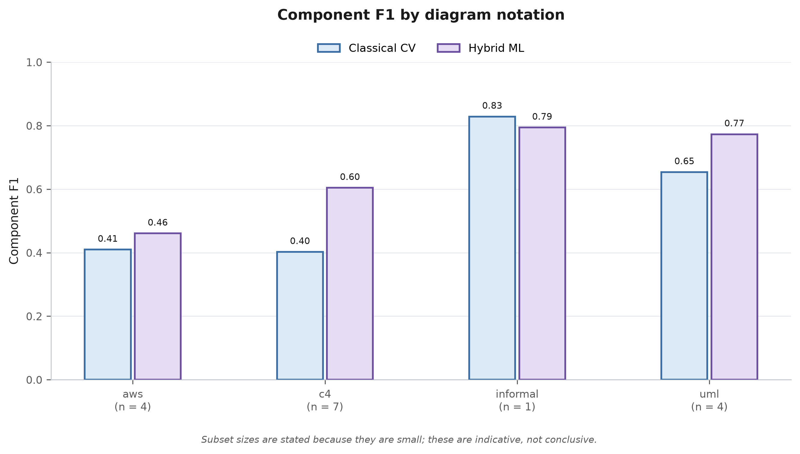

# DiagramLens

**Turn a picture of a software architecture diagram into structured, queryable JSON then measure whether a local CV pipeline, a hybrid ML pipeline, or a Vision-Language Model is the right tool for the job.**

*MSc Advanced Computer Science (AI) dissertation University of Leeds, 2026. Dissertation: “A Framework for Software Architecture Diagram Understanding and Structured Knowledge Extraction.”*

.png)

---

## Key Points

- **What it does**: you upload an architecture diagram (AWS, Azure, GCP, C4, UML, or an informal sketch); three independent extractors run over it in parallel and each returns the *same* `ArchitectureSchema` typed components plus connections which the app renders, scores, and lets you chat with.
- **The result**: on 37 hand-annotated diagrams, component F1 is **0.558 classical**, **0.713 hybrid**, **0.911 Gemini**. Gemini leads on every notation and is most dominant on cloud-vendor diagrams, where a component’s identity is an icon rather than text.
- **The catch**: Gemini is ~1.6× slower than the hybrid arm and ~3.7× slower than the classical one, sends the diagram to a third-party API, bills per call, and is not reproducible the way a deterministic local pipeline is. Which arm is “right” depends on those constraints, not on F1 alone.
- **Reproducible**: every number here comes from one offline script that needs no web server or database.

## Contents

- [Quick start](#quick-start)
- [What you get](#what-you-get)
- [The three pipelines](#the-three-pipelines)
- [Results](#results)
- [Output schema](#output-schema)
- [Benchmark dataset](#benchmark-dataset)
- [Full setup & configuration](#full-setup--configuration)
- [API](#api)
- [Repository layout](#repository-layout)
- [Report & citation](#report--citation)
- [Licensing](#licensing)

---

## Quick start

**Prerequisites:** Python 3.11, Node 20, PostgreSQL, Redis, and Tesseract OCR on `PATH`. A free Gemini API key (aistudio.google.com) for the Gemini arm.

```bash
# backend
cd backend
python -m venv venv
venv\Scripts\activate                 # Windows;  source venv/bin/activate on macOS/Linux
pip install -r requirements.txt
cp ../.env.example .env                # then set GEMINI_API_KEY in backend/.env
python scripts/migrate_benchmark_columns.py
uvicorn main:app --reload --port 8000

# frontend (new terminal)
cd frontend
npm install
npm run dev                            # open http://localhost:3000
```

Upload any architecture diagram image; all three pipelines should return within a few seconds. If the Gemini arm fails, check `GEMINI_API_KEY`. Full details, optional arms, and CPU-only PyTorch are in [Full setup & configuration](#full-setup--configuration).

**Just the benchmark, no server or database:**

```bash
python backend/scripts/run_offline_benchmark.py --arms classical hybrid   # skips the paid API
python evaluation/figures/make_results_figures.py                          # regenerates every chart
```

---

## What you get

**Compare the arms side by side**: the extracted graph (React Flow + Dagre layout), switchable between Classical / Hybrid / Gemini / All. Nodes the VLM reported without OCR support get a red dashed border and a `HALLUCINATED` tag. An animated packet-flow overlay shows the recovered data flow, its speed keyed to the connection label.

.png)

**Score it live against ground truth**: the uploaded diagram is matched to its annotation automatically; each arm gets component F1 / precision / recall, connection F1, and latency, with the winner highlighted and the specific components each arm missed or invented listed by name.

.png)

**Ask the architecture questions**: click a node and ask about it (the selection is passed as context automatically) or ask a whole-graph question. Interview Mode turns the answers into probing questions instead. This is a proof of concept for the value of structured output, not a research contribution.

.png)

---

## The three pipelines

| Pipeline | Approach | Runs where | Median latency |
|---|---|---|---|
| **Classical** | Tesseract OCR → text clustering → Canny edges → connector endpoint matching. Deterministic, no ML beyond OCR, no network. The frozen baseline. | Local | 2.5 s |
| **Hybrid** | A notation classifier picks a rule profile, then three proposers (shape detection, spatial text clustering, CLIP icon retrieval) are fused, with a dedicated skeleton-tracing connector detector. PaddleOCR PP-OCRv5. No generative model, no network. | Local | 5.9 s |
| **Gemini** | Gemini 2.5 Flash, schema-constrained output, prompt scoped to structural extraction. Zero-shot / few-shot / chain-of-thought selectable in the UI; the benchmark fixes chain-of-thought. | Google API | 9.3 s |

The hybrid arm has its **own** connection detector rather than sharing the classical one, so all three measure genuinely independent methods. Shared infrastructure (image loading, schema validation, persistence, scoring) is allowed; shared detection logic is not.

---

## Results

Measured on 37 hand-annotated diagrams across six notations. Component names are compared with normalised fuzzy matching (lowercasing, vendor-term removal, two-way acronym expansion, then the max of character / token-overlap / token-containment similarity) at a 0.75 threshold.

### Component extraction

| Pipeline | F1 | Precision | Recall | Components extracted (GT = 458) |
|---|---|---|---|---|
| Classical | 0.558 | 0.476 | 0.817 | 825 |
| Hybrid | 0.713 | 0.659 | 0.812 | 598 |
| **Gemini** | **0.911** | **0.950** | **0.897** | 444 |

The classical arm treats every surviving text cluster as a candidate - high recall, heavy over-extraction (titles, captions, legends). The hybrid arm’s notation-aware rules strip that noise, lifting precision with recall essentially unchanged. Gemini extracts 444 components against a ground truth of 458 the closest count of the three at 0.950 precision.

### Connection extraction

| Pipeline | Directed F1 | Undirected F1 |
|---|---|---|
| Classical | 0.058 | 0.095 |
| Hybrid | 0.052 | 0.115 |
| **Gemini** | **0.652** | **0.695** |

This is where the gap is widest. Both local arms extract connections *sequentially* detect components, then match connector endpoints to them so a missed or imprecisely located component breaks every connection touching it. Gemini reads components and connections jointly from the whole image, and its far higher component precision carries straight through.

### Speed

| Pipeline | Median | Range | Network |
|---|---|---|---|
| Classical | 2.5 s | 0.5–5.5 s | No |
| Hybrid | 5.9 s | 2.1–55.9 s | No |
| Gemini | 9.3 s | 4.2–16.2 s | **Yes** |

CPU only, no GPU, cold cache. Accuracy and latency trade off cleanly.

<details>
<summary><b>Component F1 by notation</b></summary>

| Notation | Classical | Hybrid | Gemini |
|---|---|---|---|
| AWS | 0.581 | 0.592 | **0.872** |
| Azure | 0.680 | 0.691 | **0.960** |
| GCP | 0.543 | 0.562 | **0.923** |
| C4 | 0.434 | 0.768 | **0.909** |
| UML | 0.654 | 0.773 | **0.873** |
| Informal | 0.612 | 0.882 | **0.938** |

Gemini stays above 0.87 everywhere; the local arms swing widely. Gemini’s lead is largest on GCP and AWS (icon-carried identity) and smallest on informal diagrams (plain labelled boxes). The hybrid arm’s biggest gain over classical is on C4 (0.434 → 0.768), from learning to read bracket tags and description lines as decoration rather than content.

</details>

<details>
<summary><b>Unsupported components in the VLM output</b></summary>

Each name Gemini reports is checked against full-page OCR of the image. **30 of 444 reported components (6.8%), across 10 of 37 diagrams, had no OCR-observable textual support.** This is not a hallucination rate the check itself misfires on long phrases and single-character labels, and some genuine flags are over-extractions rather than invented components. It is a useful indicator, not a measurement of the rate, and it is applied only to the generative arm.

</details>



---

## Output schema

<details>
<summary>Every pipeline emits the same <code>ArchitectureSchema</code></summary>

```json
{
  "pipeline": "hybrid",
  "diagram_standard": "uml",
  "components": [
    { "id": "h1", "name": "License Services Java", "type": "service", "stereotype": "component" }
  ],
  "connections": [
    { "source": "License Services Java", "target": "HASP Java Native Interface Proxy",
      "directed": true, "label": null }
  ]
}
```

Core fields (`id`, `name`, `type`, `confidence` for components; `source`, `target`, `directed`, `label` for connections) are produced by every arm. Connections reference components **by name, not ID**, because the three arms assign IDs differently and only names are comparable across them. Optional extension fields (`stereotype`, `c4_level`, `technology`, `line_style`, `arrowhead_*`, `proposer`, …) let a notation-specific arm record what it knows without forcing the others to invent values.

</details>

---

## Benchmark dataset

37 diagrams, manually annotated, every entry recording its source URL and licence for independent verification.

| Notation | Diagrams | Components | Source |
|---|---|---|---|
| AWS | 7 | 107 | AWS Architecture Center |
| Azure | 5 | 70 | Azure Architecture Center |
| GCP | 5 | 71 | Google Cloud reference architectures |
| C4 | 11 | 81 | Big Bank plc & Spring PetClinic workspaces (c4model.com) |
| UML | 4 | 41 | uml-diagrams.org component & deployment examples |
| Informal | 5 | 88 | `system-design-primer` repository |
| **Total** | **37** | **458** | |

AWS, Azure, and GCP are treated as three distinct notations because their iconography differs and the classifier distinguishes them. Every diagram was drawn by practitioners (not generated by a diagram-as-code tool) and left unaltered from its published form.

**Reproduce it** (no web server or database required):

```bash
python backend/scripts/run_offline_benchmark.py          # scores all three arms → evaluation/results/offline_benchmark.json
python backend/scripts/run_offline_benchmark.py --arms classical hybrid   # skip the paid Gemini calls
python evaluation/figures/make_results_figures.py         # regenerate every chart
python backend/scripts/result_stability.py                # bootstrap + notation-fold stability analysis
python backend/scripts/validate_ground_truth.py           # annotation integrity check
```

---

## Full setup & configuration

### Requirements

Python 3.11 · Node.js 20 · PostgreSQL · Redis · Tesseract OCR · CPU-compatible PyTorch. A Gemini API key is required for the Gemini pipeline.

### Backend

```bash
cd backend
python -m venv venv
venv\Scripts\activate                      # Windows
# source venv/bin/activate                 # macOS / Linux
pip install -r requirements.txt
cp ../.env.example .env                     # then add GEMINI_API_KEY=your_key_here
python scripts/migrate_benchmark_columns.py
uvicorn main:app --reload --port 8000
```

`.env` must live in `backend/`, and `uvicorn` must be started from that directory settings resolve relative to the working directory.

**Additional dependencies:**

- **Tesseract** must be installed and on `PATH`.
- **PaddleOCR** downloads its PP-OCRv5 mobile weights on first use (a few seconds, then cached).
- Install **one** OpenCV distribution only — the project needs the contrib build: `pip install opencv-contrib-python` (pinned below 5.x).
- CPU-only PyTorch: `pip install torch torchvision --index-url https://download.pytorch.org/whl/cpu`

**Optional arms:**

```bash
ICON_BANK=1        uvicorn main:app        # enable the CLIP icon-retrieval proposer (off by default)
HYBRID_VERSION=v1  uvicorn main:app        # run the earlier SAM + CLIP + TrOCR hybrid pipeline
```

The icon bank must be built first: `pip install diagrams`, copy `<site-packages>/resources/{aws,azure,gcp}` into `backend/data/icons/`, then `python backend/scripts/build_icon_bank.py`.

### Frontend

```bash
cd frontend
npm install
npm run dev                                 # http://localhost:3000
```

---

## API

| Endpoint | Description |
|---|---|
| `POST /api/analyze` | Upload an image; runs all three pipelines in parallel |
| `POST /api/benchmark` | Score an extraction against a ground-truth annotation |
| `GET /api/dashboard` | Aggregate benchmark statistics across all runs |
| `GET /api/sessions` | Recent uploads |
| `POST /api/chat` | Ask questions about an extracted architecture |

---

## Repository layout

```text
backend/
  services/          Extraction pipelines (classical, hybrid, hybrid_v1) and supporting modules
                      OCR engine, shape/connection detectors, notation classifier & profiles,
                     icon bank, unsupported-component check, fuzzy-matching metrics, LLM adapters
  routers/           API endpoints (analyze, benchmark, chat, dashboard)
  scripts/           run_offline_benchmark, result_stability, validate_ground_truth, build_icon_bank
frontend/            Next.js — canvas, benchmark panel, packet animation, chat, dashboard
evaluation/
  ground_truth/      Annotated diagrams (JSON + source image, each)
  figures/           Figure generation scripts + rendered PNGs + .drawio sources
  results/           offline_benchmark.json / result_stability.json — the numbers in this README
docs/                Project documentation
```

---

## Report & citation

The full methodology, ablation studies (Segment Anything, CLIP text-prompt classification, TrOCR, and skeleton-tracing vs straight-segment connector detection were all implemented, calibrated, and rejected), stability analysis, and threats-to-validity discussion are in the dissertation *A Framework for Software Architecture Diagram Understanding and Structured Knowledge Extraction* (University of Leeds, 2026), not included in this repository.

**Contributions:** a controlled comparison of three extraction paradigms under one schema contract; a hand-annotated 37-diagram benchmark across six notations with verifiable sources; an OCR-based unsupported-component check for the generative arm; empirical accuracy/latency/deployment trade-off findings; and a reproducible offline evaluation harness.

---

## Licensing

Project code is provided under the licence included in this repository. Benchmark diagrams remain subject to their **original source licences** source URLs and licence information are recorded with each annotation. The icon bank is derived from vendor icon sets distributed through the MIT-licensed `diagrams` package; AWS, Microsoft, and Google Cloud icons remain the property and trademarks of their respective owners. Raw vendor icon images are not committed; the derived CLIP embeddings can be regenerated locally. Users are responsible for complying with the licences and terms applicable to source diagrams and vendor assets.

---

**Yash Rajabhau Ingle** MSc Advanced Computer Science (AI), University of Leeds, 2026
Repository: <https://github.com/yashingle-1/DiagramLens>
